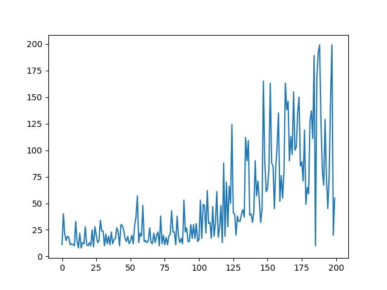
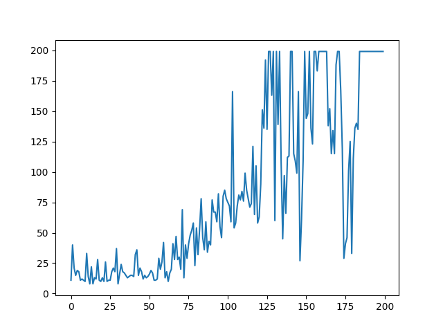

> 使用AC，A2C算法训练了CartPole游戏，具体细节在我的博客中：

代码大部分内容均有详细注释，故只作简要概述以及结论分析。

由于参考资料实在过多（修复了各种奇怪的bug），不作引用。

## 代码概述

代码使用的是`VScode`的`python`环境，使用`OpenAI-gym`的`CartPole-v0`作为测试环境，`matplotlib`的`pyplot`和`animation`作为可视化以及`gif`动图的输出（注意，`gif`输出采用的`writer`是`ffmpeg`，这需要另行配置，程序会提示当前可用的`writer`），`AC`代码没有找到现成库，`Actor`和`Critic`均使用的`tensorflow`下的`keras`构建神经网络，而且都是3层网络（包括输出层和输入层）。

在运行代码时，可以通过调整注释掉的代码改变代码的输出，得到想要的内容。另外，为避免奇怪的冲突，默认`gif`保存的位置为绝对位置D盘。注意，由于`plt.show()`的位置在输出`gif`的函数之前，关掉图像后才能获得gif动图（这是为了避免gif和图像被输出到一起）。

程序在`AC`的C（`Critic`）中采用Q值作为评判标准，在`AAC`中将`Advantage`，即`TD-error`作为评判标准。

同时，由于`Advantage`中含有本来`model`自己的输出，使得`AAC`结果不容易收敛，`Critic`代码采取了双神经网络的形式，一个网络负责进行训练，而另一个神经网络负责输出（作为副本），并以一定周期（程序内为5帧）与前一个神经网络进行同步（更新参数），由此加快收敛。

## 实验结果

使用AC结果如下图，其中横坐标为迭代次数，纵坐标为程序坚持的时间（也是它除最后一次外的`reward`），相关的演示视频存放在当前文件夹内的`ACgif`文件夹中，1-10为初始的10次迭代的表现，190-200为最后10次迭代的表现。

使用`AAC`结果如下图，和`AC`一样，其中横坐标为迭代次数，纵坐标为程序坚持的时间（也是它除最后一次外的`reward`），相关的演示视频存放在当前文件夹内的`AACgif`文件夹中，1-10为初始的10次迭代的表现，190-200为最后10次迭代的表现。

可以看出，AC的结果虽然也随着迭代次数的上升逐渐变好，但在使用同样的参数下逼近的效率以及稳定性都不如AAC好，二者在很长一段迭代里（前50）都属于很快结束的状态，但AAC比AC更早抬升并触及200的结果，这说明AAC在寻找优化路径和沿着路径优化速度上都比AC要强。